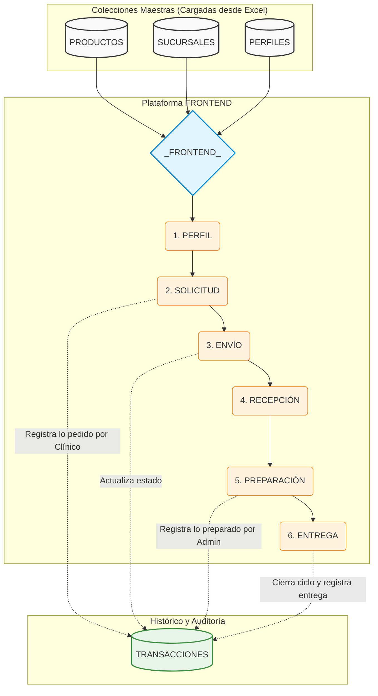

# Arquitectura y Flujo de Datos: Proyecto Beacon  

Este documento explica la arquitectura conceptual y el flujo de información para el sistema de control de inventario y pedidos del Proyecto Beacon, basándose en el diagrama de pizarra trazado. El objetivo es preparar el modelo para su futura implementación en una base de datos NoSQL (Firebase), asegurando la trazabilidad entre el área clínica y administrativa. 

---

## Diagrama de Flujo Visual (Mermaid) 

A continuación, se presenta la digitalización del diagrama para visualizar cómo viaja la información desde las bases maestras, pasa por los 6 estados del frontend y finaliza guardando el registro histórico en las transacciones:

  

  

---

  

## 1. Bases de Datos (Colecciones Maestras)

En el lado izquierdo del diagrama se identifican las entidades maestras que alimentan la plataforma. Para facilitar la manipulación y actualización masiva, estas tres colecciones se cargarán e inicializarán directamente desde planillas **Excel**:

  

*   **`PRODUCTOS`**: Catálogo completo de insumos clínicos y administrativos disponibles para solicitar.

*   **`SUCURSALES`**: Identificadores y detalles de las distintas clínicas o centros donde opera el sistema.

*   **`PERFILES`**: Roles de los usuarios del sistema. Principalmente divididos en dos grandes actores:

    *   **Perfil Clínico**: Quien genera la necesidad (enfermería, sala).

    *   **Perfil Administrativo/Bodega**: Quien recibe la necesidad, prepara y despacha los insumos.

  

---

  

## 2. Plataforma (`_FRONTEND`) y Flujo Operativo

La plataforma centraliza la interacción de los usuarios con las bases de datos. Cuando un usuario interactúa con el frontend, se desencadena un flujo secuencial de **6 estados**, los cuales dictan el ciclo de vida del pedido:

  

1.  **`PERFIL` (Autenticación y Rol):** El sistema lee la base de `PERFILES` para identificar quién está ingresando. Esto define qué vistas y acciones tiene permitidas (ej. un clínico solo ve la opción de pedir, el administrativo ve la cola de trabajo).

2.  **`SOLICITUD` (Creación del Pedido):** El perfil clínico accede al catálogo de `PRODUCTOS` de su respectiva `SUCURSAL` y arma el carrito con los insumos necesarios para la jornada.

3.  **`ENVÍO` (Confirmación):** El clínico confirma el pedido. La solicitud sale de su bandeja y entra a la cola operativa de la bodega.

4.  **`RECEPCIÓN` (Toma de Conocimiento):** El perfil administrativo visualiza la nueva solicitud entrante y la acepta, asumiendo la responsabilidad del pedido.

5.  **`PREPARACIÓN` (Picking):** El equipo administrativo reúne físicamente los productos solicitados. Aquí pueden ocurrir ajustes si hay quiebres de stock (ej. se pidieron 10, pero solo se preparan 8).

6.  **`ENTREGA` (Despacho y Cierre):** Los insumos son entregados físicamente al área clínica y el sistema marca el flujo como completado.

  

---

  

## 3. Registro Histórico (`TRANSACCIONES`)

El componente clave del diagrama es la conexión desde el flujo operativo hacia la entidad **`TRANSACCIONES`** (lado derecho). 

  

En lugar de solo sobrescribir el estado actual, el sistema generará un **histórico de transacciones**. Cada vez que el flujo avanza (de solicitud a envío, de preparación a entrega), se guarda un registro en la base de datos que responde a las siguientes preguntas clave para el control de inventario y auditoría:

  

*   **¿Qué pidió el clínico hoy?** (Capturado en el paso 2 y 3).

*   **¿Qué recibió y preparó el administrativo?** (Capturado en el paso 4 y 5, detectando discrepancias operativas).

*   **¿Qué se entregó finalmente?** (Capturado en el paso 6).

  

Este log histórico permitirá en el futuro extraer KPIs de nivel de servicio, tiempos de respuesta de bodega y exactitud del inventario.

  

---

  

## 4. Próximos Pasos para la Implementación en Firebase

Para llevar este diagrama a Firebase:

  

1.  **Estructura NoSQL:** Se crearán 4 colecciones principales en Firestore (`productos`, `sucursales`, `perfiles`, `transacciones`).

2.  **Carga de Excel:** Se desarrollará un script (por ejemplo, en Python usando la librería `pandas` y `firebase-admin`) que leerá los archivos Excel de productos, sucursales y perfiles, y hará un *batch upload* (subida masiva) hacia las colecciones maestras de Firestore.

3.  **Estructura del Documento de Transacción:** Cada documento en la colección `transacciones` contendrá un arreglo de "eventos" o "cambios de estado" con su respectivo *timestamp* (fecha y hora) y el ID del usuario que ejecutó la acción, asegurando el historial completo del ciclo clínico-administrativo.

  
**